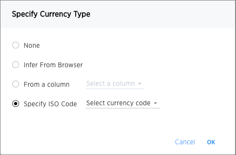

# Set the format to use when showing currencies

You can set a format for how currencies are displayed in tables and charts when using the ThoughtSpot Data API or Embedding. For example, you can display currencies in a standard European Euro or US Dollar format based on the data modeling setting **Currency Type**.

When you specify the currency type of your data on the Manage Data page, your currency data will only display the correct format and currency code in the embedded use case. Currency specific symbols are available in the non-embedded use case as well, but they are not localized. All users are treated as if they are in en-US locale unless they are in embed mode and their browser configuration tells ThoughtSpot that they are in some other locale. For example, 100 Polish Zloty appears as 100zł to a user in Poland, but without localization enabled, it appears as PLN 100.

This subtle difference can be seen when you use the REST API. See the ThoughtSpot Application Integration Guide for more information on the API.

To change the currency format used to display a column's values:

1.   Find the **Currency Type** for the column whose display format you want to change. 
2.   Click on it to open the **Specify Currency Type** menu. 

      

3.   Select one of the following ways you would like to change the format. 
    -   **Infer From Browser**

        Your currency data will be modeled upon the locale of your browser setting.

    -   **From a column**

        Your currency data will be modeled upon the existing currency information in the selected column.

        **Note:** This option is disabled if there is no VARCHAR column to choose from.

    -   **Specify ISO Code**

        Your currency data will be modeled upon your selection from the available currency code choices.

4.   Click **Ok** to save your changes. 

**Related information**  

[Model the data for searching](semantic_modeling.html#)

