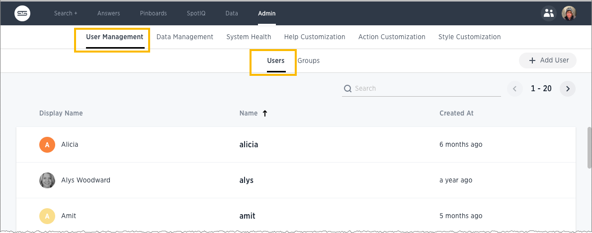

# Add a user

You will create a user account for each unique person who will access ThoughtSpot, either manually or through LDAP. This procedure shows how to creating a user manually.

When you create a user, you can assign group memberships. The group's privileges and permissions apply to all of its members. Any user you create will be added to the group **All** automatically.

1.   [Log in to ThoughtSpot from a browser](../setup/accessing.html#). 
2.   Click on the **Admin** icon, on the top navigation bar. 

    

3.  In the **Admin** panel, click on **User Management** and **Users**.

      

4.   Click the **+ Add User** button on the upper right hand side of the list of groups. 

      

5.   Enter the details for the new user: 

      

    1.   **Name**: A unique name for the user \(usually their first and last name\). 
    2.   **Username**: A login name for the user. 

        **Note:** Usernames must be unique and lowercase.

        If you are using Active Directory to authenticate users, and your LDAP configuration requires users to be created manually \(i.e. they are not created automatically in ThoughtSpot upon authentication\), the username you specify has to be domain qualified \(e.g. username@ldap.thoughtspot.com\), and you must enter a dummy password.

    3.   **Password** and **Confirm Password**: A temporary password. 
    4.   **E-mail Address**: The user's email address. This is used for notification when another user shares something with them. 
    5.   **Add to group**: Select all the groups the user will belong to. If you add the user to a group that has the privilege **Has administration privileges**, note that they will be able to see all the data in ThoughtSpot. Administrators can see all data sources, and [Row level security](../data_security/about_row_security.html#) does not apply to them.
6.   Click **Save** to create the user. 

    When you create a new user, the groups they belong to define the user's:

    -   Privileges - the actions they are allowed to do, which are defined when you [Add a group and set security privileges](add_group.html).
    -   Permissions - the data they can access and view, which is defined when you [Data security](../data_security/sharing_security_overview.html#).

