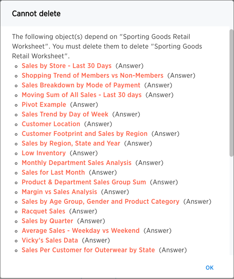
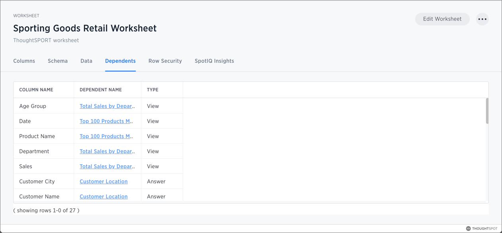

# Delete a worksheet or table

When you try to delete a worksheet or table, you'll see a message listing any dependent objects that must be removed first.

ThoughtSpot checks for dependencies whenever you try to remove a table or worksheet. A list of dependent objects is shown, and you can click on them to delete them or remove the dependency. Then you'll be able to remove the table or worksheet.

To delete a worksheet or table:

1.   Click on **Data**, on the top navigation bar. 

      

2.   Find the worksheet or table you want to remove in the list, and check the box next to its name. 
3.   Click the **Delete** icon. 

      

4.   If you are attempting to delete a data source with dependent objects, the operation will be blocked. You will see a warning, with a list of dependent objects with links. Click on the link for an object to modify or delete it. When all its dependencies are removed, you will be able to delete the data source. 

      

5.   You can also click on the name of a worksheet or table and then click **Dependents**, to see a list of dependent objects with links. The **Dependents** list shows the names of the dependent objects \(worksheets and pinboards\), and the columns they use from that source. You can use this information to determine the impact of changing the structure of the data source or to see how widely used it is. Click on a dependent object to modify or delete it.

      

