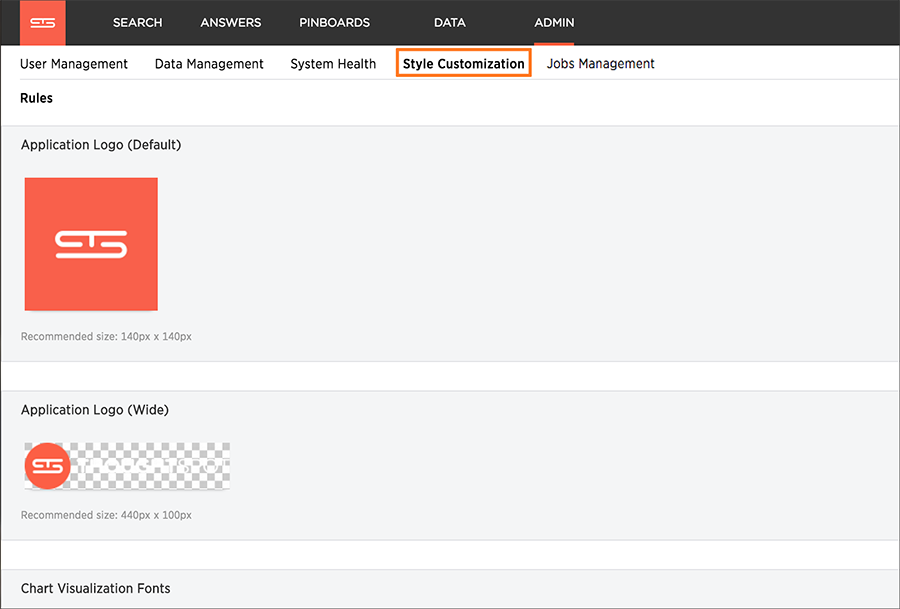

# Perform Style Customization

Make changes to the style of your ThoughtSpot interface in the **Style Customization** page. This option gives you defined, yet impactful capabilities for re-branding the interface, so having some understanding of typography and color schemes would be helpful.

To re-brand the interface:

1. Log in to ThoughtSpot from a browser.
2. Click on the **Admin** icon, on the top navigation bar.

    

3. In the **Admin** panel, click on **Style Customization**.

     

    Once in the menu page, you can:

    -   [Upload application logos](upload_application_logos.html#)
    -   [Set chart and table visualization fonts](set_chart_and_table_visualization_fonts.html#)
    -   [Choose a background color](choose_background_color.html#)
    -   [Select chart color palettes](select_chart_color_palettes.html#)
    -   [Change the footer text](change_the_footer_text.html#).
    **Note:** The ThoughtSpot logo in the middle of the page is automatically removed when Style Customization is enabled.

-   **[Upload application logos](../../application_integration/custom_branding/upload_application_logos.html)**  
You can replace the ThoughtSpot logo, wherever it appears in the ThoughtSpot web application, with your own company logo.
-   **[Choose a background color](../../application_integration/custom_branding/choose_background_color.html)**  
You can change the background color to match with your company's theme. The custom background color is in effect when using the API to embed visualizations and pinboards.
-   **[Select chart color palettes](../../application_integration/custom_branding/select_chart_color_palettes.html)**  
You can change the color palettes that are used to create your charts. Although it is suggested that you stick with the default settings, it is possible to create your own appealing color palettes if done correctly.
-   **[Change the footer text](../../application_integration/custom_branding/change_the_footer_text.html)**  
You can change the footer text to reflect your company's message.

**Parent topic:** [About Style Customization](../../application_integration/custom_branding/about_style_customization.html)
