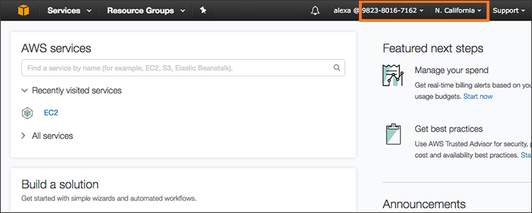
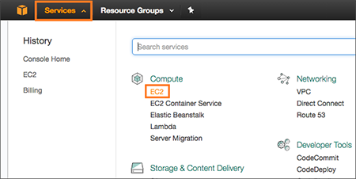
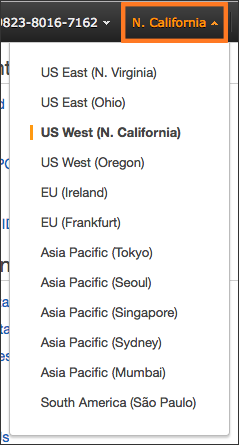
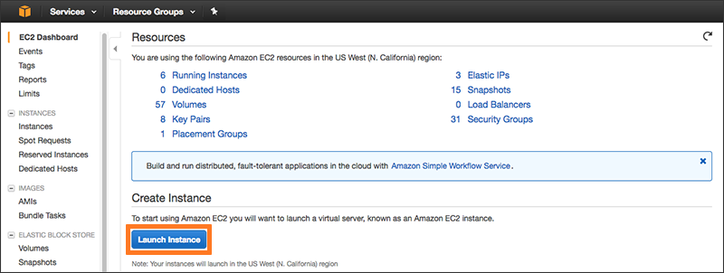

# Launch an instance

Follow these steps to set up the VMs and launch ThoughtSpot.

ThoughtSpot instances on AWS need AWS EC2 instances to be provisioned in the AWS account before ThoughtSpot can be installed and launched. Please make sure you follow the guidelines below for your EC2 details:

-   EC2 instance type: r4.16xlarge.
-   Networking requirement: 10GbE network is needed between the VMs. This is the default for the chosen VM type.
-   Security: VMs need to be accessible from each other, which means they need to be on the same Amazon Virtual Private Cloud (VPC) and subnetwork. Additional external access may be required to bring data in/out of the VMs to your network.
-   Number of EC2 instances needed: Based on the datasets, the number of EC2 instances needed will vary. Also for staging larger datasets (\> 50 GB per VM), there may be a need to provision additional attached EBS volumes that are SSD gp2 provisioned.

To set up the VMs and launch ThoughtSpot:

1.   Log in to your AWS account from the [AWS Amazon sign in page](https://console.aws.amazon.com/console/home). 
2.   Provide ThoughtSpot Support with your AWS account ID and the region where the VMs will be hosted. They will then grant you permissions and share the current ThoughtSpot base AMI with you. 

    **Tip:** You can find your account ID and region on the top right corner of the AWS console.

      

3.   Navigate to the EC2 service dashboard by clicking **Services**, then select **EC2**. 

      

4.   Make sure your selected region is correct on the top right corner of the dashboard. If not, select a different region you would like to launch your instance in. Let ThoughtSpot Support know if you change your region. 

      

5.   Create an instance by clicking **Launch Instance**. 

      

6.   Select the appropriate AMI from the AMI Selection step by clicking **Select**. The ThoughtSpot shared AMI can be found under the **My AMIs** tab. 

      

7.   Select r4.16xlarge as the instance type. Then click **Next: Configure Instance Details**. 
8.   Configure the instances by choosing the number of EC2 instances you need based on your EC2 details. The instances need to be on the same VPC and subnetwork. Then click **Next: Add Storage**. 
9.   The default storage specified by the ThoughtSpot AMI should be populated. Optionally, you can add extra storage. Based on the dataset size requirement you might need to provision and prepare (formatting/file system placement) an extra storage of 400 GB per VM that is SSD gp2 provisioned. Click **Next: Add Tags** when you are done modifying the storage size. 
10.  Set a name for tagging your instances. Then click **Next: Configure Security Group**. 
11.  Select an existing security group to attach new security groups to such that it meets the security requirements for ThoughtSpot. 

    **Note:** Security setting for ThoughtSpot:

    -   The VMs need intragroup security, i.e. every VM in a cluster needs to be accessible from one another. For easier configuration, it is better to open all accesses from across VMs in a cluster.
    -   Additionally, more ports need to be opened on the VM to provide data staging capabilities to your network. Check the [network ports reference](../../admin/setup/firewall_ports.html#) to determine the minimum required ports that need to be opened for your ThoughtSpot appliance.
12.  Click **Review and Launch**. After you have reviewed your instance launch details, click **Launch**. 
13.  Choose a key pair. A key pair consists of a public and private key used to encrypt and decrypt login information. If you don’t have a key pair, you should create one, otherwise you won’t be able to SSH into the AWS instance later on. 
14.  Click **Launch Instances**. Wait a few minutes for it to fully start up. Once it has started up, it will show up on the EC2 console. 
15.  Contact ThoughtSpot Support to complete your ThoughtSpot installation. 

**Parent topic:** [Installation and setup](../../aws/setup/installation_and_setup.html)

