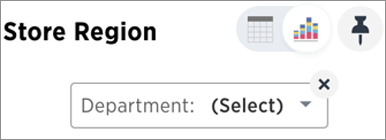

When you add a value to your search, it becomes a filter. Simple filters can be applied to an answer, while pinboard filters can be applied to all visualizations of a pinboard. You can find out more about [pinboard filters in the pinboards section](about_pinboard_filters.html#).

## Where filters appear in ThoughtSpot

In search, filters appear in white boxes in the search bar.

 

In an answer or a pinboard, filters appear just below the title. For pinboards, your filters apply to all worksheet-based visualizations in the pinboard.

 

If you ever find that your search or pinboard does not appear to contain all the data you want to see, check for any existing filters and remove them by clicking the **X** to see all the data.

Note that filtering on NULL and empty values is a special case. You can find out more about how these values are represented and how to filter for them in [About filtering on null, blank, or empty values](about_filters_for_null.html#).

## Simple filters

Simple filters can be applied to searches in a few different ways.

You can use the search bar or the **Change Configuration** menu to add a filter to a search. You can apply simple filters to your search, whether it shows a table or a chart. Your filters remain part of the search even when you change the visualization type.

When adding a filter from the **Change Configuration** menu, numeric columns and text columns provide you with a checkbox selector for values. If the column contains a date, you'll see a calendar selector when applying a filter. This is also where you'll go to apply bulk filters.

-   **[Add a filter to a table](../../pages/end_user_guide/end_user_search/filter_from_column_headers.html)**  
You can add a simple filter from a column header while viewing your answer as a table.
-   **[Add a filter to a chart](../../pages/end_user_guide/end_user_search/filter_from_chart_axes.html)**  
You can add a simple filter from a chart axis while viewing your answer as a chart.
-   **[Add a filter from the search bar](../../pages/end_user_guide/end_user_search/add_filter_from_search.html)**  
You can add a simple filter from the search bar while creating your answer.

## Bulk filters

If you have a large worksheet or table with thousands or millions of rows, you may want to create bulk filters. You can paste in a list of filter values, without having to click the box next to each value in the filter selector.

Bulk filters can be very useful when you have a very large worksheet or table. You can use them to filter a large list of values easily. For example, this is useful if you want to only search on a list of products that your manager sent to you in an email. You can cut and paste those values into the bulk filter box to quickly generate a report or chart that includes only those items of interest.

-   **[Create a bulk filter](../../pages/complex_searches/create_bulk_filter.html)**  
You can create a bulk filter by pasting a list of values, separated by commas, semicolons, new lines, or tabs, into the bulk filter box. This allows you to easily search a large list of filters repeatedly.
