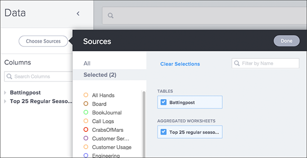
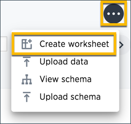

# Create a search from a search saved as a worksheet

After creating a worksheet from a search (also called an aggregated worksheet) and linking it to related data, you're ready to create your new search.

To do a search on the aggregated worksheet, along with any data sources you linked:

1.   Click the search icon, and select **Data Source**. Choose your linked sources. 

      

2.   Do a search using columns from the linked sources, including any aggregations you created. 
3.   Test the result, to make sure it’s what you expect. If your search shows no data found or doesn't look right to you, it is possible that one of the links between your sources was made on the incorrect column. Check the relationships you created and try linking using a different column, to see if that gives the expected search results.
4.   Once you have the expected answer, you can create a worksheet to make it easier for you and other people to use. To do this, click the Data icon. 
5.   Click the **Actions** icon from the upper right side of the screen, and select **Create worksheet**. 

    

6.   Choose both views using **Choose Sources**. 
7.   You may need to rename some columns appropriately for searching. 
8.   Share the worksheet with the appropriate users and groups. 

**Parent topic:** [About worksheets from searches](../../pages/complex_searches/about_query_on_query.html)

