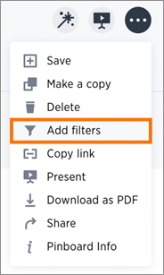
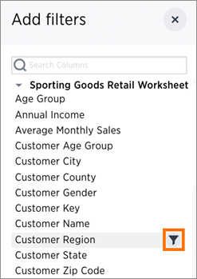
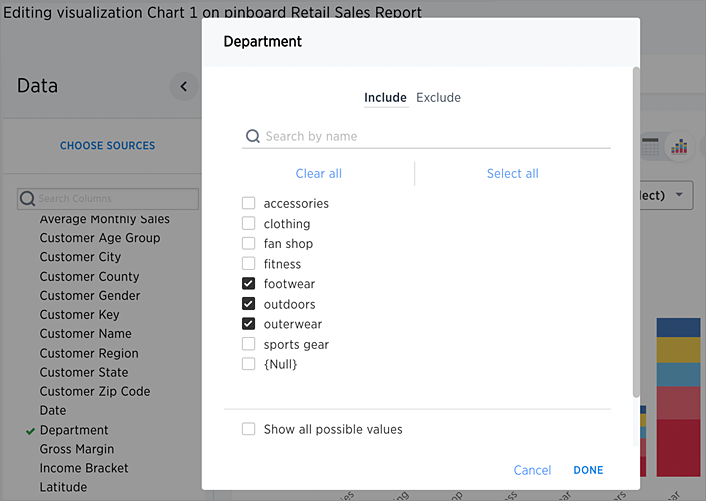

Filters, including bulk filters, can be applied to pinboards just as with tables and charts. These kinds of filters apply to an entire pinboard, making it easy to see only the data that you are interested in across the tables and charts within a pinboard.

## When to use a pinboard filter

Pinboard filters can be very useful when you want to apply the same filters to more than one related visualization. You can narrow the focus of your pinboard for specific purposes or audiences.

When you apply a filter, the pinboard is not automatically saved with your filter applied. This is to encourage ad hoc filtering. Therefore, people with read-only access can create pinboard filters. You must have edit access to the pinboard, and view access (or higher) to the underlying data source in order save a pinboard filter.

Note that pinboard filters only apply to the tables and charts that are based on worksheets. If a pinboard also includes tables and charts that were created from underlying tables or on user uploaded data, the filters don’t apply to them.

-   **[Create a pinboard filter](../../pages/complex_searches/create_a_pinboard_filter.html)**  
You can create a filter in the pinboard view for any pinboard. This allows you to easily manipulate the visualizations and view the modified presentation in one place.

## Create a pinboard filter

You can create a filter in the pinboard view for any pinboard. This allows you to easily manipulate the visualizations and view the modified presentation in one place.

Here is an example that shows you how to add a single filter to a pinboard. To create a pinboard filter:

1.   Click the **Actions** button, and click **Add filters**.

     

2.   In the populated columns menu, click the **Add filter** icon next to the columns you would like to use as filters.

     

3.   Choose the values you are interested in by typing them in, selecting the appropriate checkboxes, or using **Add values in bulk**. Then click **Done**.

     

4.   Your applied filter will sit at the top of the pinboard, where you can either edit or delete it.

     

    When you apply a filter, the pinboard is not automatically saved with your filter applied to every object in the pinboard that was created from a worksheet. Pinboard filters do not apply to tables and charts built directly on top of base tables.
