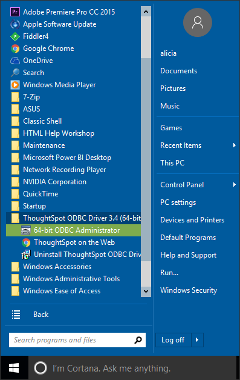
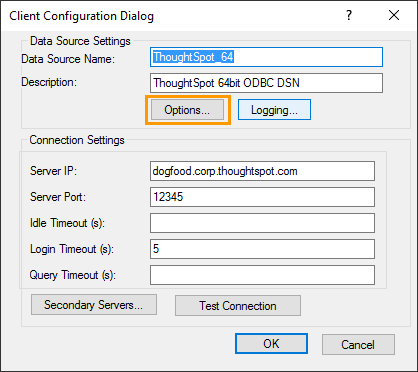
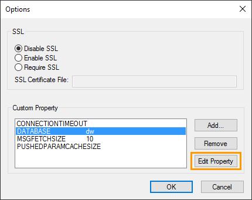

---

title: [Change the ODBC Configuration on Windows]
tags: [formatting]
keywords: tbd
last_updated: tbd
summary: "Use the ODBC Administrator to change the ODBC configuration."
sidebar: mydoc_sidebar
---
# Change the ODBC Configuration on Windows

Once installation is complete, you can use the ODBC Administrator to change the ODBC configuration. For example, you may want to add a default schema or change the server IP address or the default database.

It is recommended to add a default schema. If you don't specify a default schema, you will need to supply it every time you use the ODBC driver. If you aren't using schemas in ThoughtSpot, you should specify the default schema, which is "falcon\_default\_schema". If you don't supply a default schema, and you don't specify a schema when using the ODBC driver, you will see an error that says the schema could not be found.

To make changes to the ODBC settings on Windows:

1.  Launch the **ODBC Administrator**. You can find it in your programs under **ThoughtSpot ODBC Driver**.

     

2.   Click the **System DSN** tab.
3.   Select the data source you want to modify, and click **Configure**.

     

4.   Some properties are exposed through the dialog box, and you can make the settings there. If you want to change or add a custom property, click **Options**.

     

5.   To change a custom property, click **Edit Property**. To add a new custom property, click **Add**.

     

6.   Type in the key (if needed) and add the value and click **OK**. You can add a default schema to use by adding a new custom property with the key "SCHEMA". If you don't use custom schema names in ThoughtSpot, use the value "falcon\_default\_schema". If you add a default schema, that will save you from having to supply the schema every time you use the ODBC connection.

     

7.   Edit any other custom properties you need to change, and click **OK** again.
8.   Test the settings by clicking **Test Connection**.
9.   If everything is working, click **OK**, to save your settings. If not, you may want to [enable ODBC logging](../troubleshooting/troubleshooting_ODBC.html#).

**Parent topic:** [Install the ODBC Driver on Windows](../../data_integration/clients/install_odbc_windows.html)
