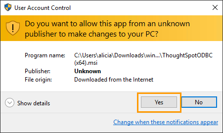
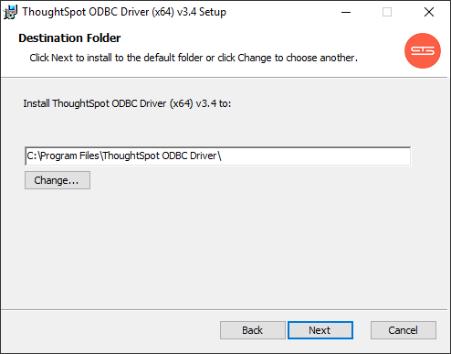
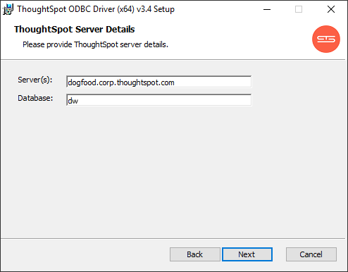
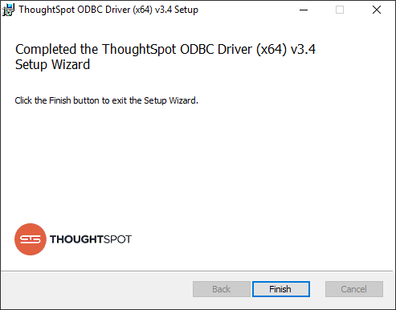

# Install the ODBC Driver on Windows

The ODBC driver for Windows requires Visual C++ Redistributable for Visual Studio 2013

You will be prompted to install it during installation of the driver if it isn't already installed.

It is important to note the following about the ODBC login information:

-   Database username: This is the name of a ThoughtSpot user with administrator permissions.

    **Attention:** This is not the machine login username.

-   Database password: This is the ThoughtSpot user password.

    **Attention:** This is not the machine login password.

To obtain and install the ODBC driver for Windows:

1.   Navigate to the Downloads page in the Help Center to download the ODBC driver onto your Windows workstation.
2.   Unzip the file you downloaded.
3.   There are two different Windows ODBC installers included in the file you downloaded. Choose the installer for your version of Windows:

    -   ThoughtSpotODBC (x86).msi for Windows 32-bit
    -   ThoughtSpotODBC (x64).msi for Windows 64-bit
4.   Double click the .msi file you downloaded to start the installation.
5.   You will see a security warning. Select **Yes** to continue.

     

6.   Click **Next** to continue.

     

7.   Accept the End User License Agreement (EULA), and click **Next**.
8.   Specify the destination folder where the driver will be installed.

     

9.   Enter the ThoughtSpot server details, and click **Next**.

    -   For **Server(s)**, provide a comma separated list of the IP addresses of each node on the ThoughtSpot instance.

        If you need to obtain the IP addresses of the nodes in the cluster, you can run the command `tscli node ls` from the Linux shell on the ThoughtSpot instance.

    -   For **Database**, optionally specify the database to use. If you skip this entry, you'll need to provide the database each time you connect using ODBC.
     

10.  Confirm that the install can begin by clicking **Install**.
11.  You will see a confirmation message when the installation has finished. Click **Finish**.

     

12.  If you need to make changes to the ODBC configuration later, you can [Change the ODBC Configuration on Windows](change_odbc_windows.html#).

-   **[Change the ODBC Configuration on Windows](../../data_integration/clients/change_odbc_windows.html)**  
Once installation is complete, you can use the ODBC Administrator to change the ODBC configuration. For example, you may want to add a default schema or change the server IP address or the default database.
-   **[Add a New Data Source to ODBC on Windows](../../data_integration/clients/add_new_ODBC_source_windows.html)**  
You can add multiple ThoughtSpot data sources to your ODBC configuration. This capability supports connecting to multiple ThoughtSpot instances.

**Parent topic:** [About the ODBC Driver](../../data_integration/clients/about_odbc.html)
