# Set up the JDBC Driver for Pentaho

Use JDBC to connect to the Falcon Simba server from Pentaho. The connection will be made between a new Falcon Table Input and Output objects.

Before starting the Pentaho Data Integration (PDI) client and creating the connection, ensure that the Simba JDBC client libraries are present in the Pentaho client/server machines. This will ensure that they can be picked up at runtime. Please copy the SimbaJDBCClient4.jar file or the thoughtspot_jdbc4.jar file to the following directories:

-   <Pentaho_install_dir\>/server/data-integration-server/tomcat/webapps/pentaho-di/WED-INF/lib/
-   <Pentaho_install_dir\>/design-tools/data-integration/lib/
-   <Pentaho_install_dir\>/server/data-integration-server/tomcat/lib/
-   <Pentaho_install_dir\>/design-tools/data-integration/plugins/spoon/agile-bi/lib/

You can download these files from the Help Center.

In this example, we are using Spoon, the graphical transformation and job designer associated with the PDI suite. It is also known as the Kettle project. Therefore, the screenshots will reflect this client version.

To set up the JDBC driver using Pentaho:

1.   Open the PDI client. You may use the command:

    ```
    ./spoon.sh &>/dev/null &
    ```

2.   Right click **Transformations** in the left View tab, and click **New** to create a new transformation.

     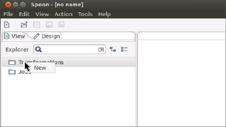

3.   Click **Input** under the Design tab to expand it, and drag and drop **CSV File Input** to the Transformation window. This will bring in a new CSV file.

     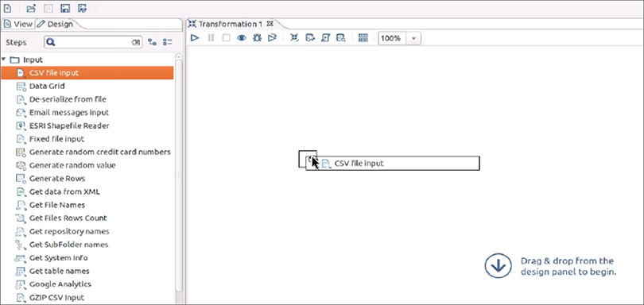

4.   Double click the **CSV File Input** icon to open the CSV Input dialog box.
5. Name the Step. Then click **Browse** next to the Filename field to provide the file you want to read from. Once you have selected the file, click **OK**.

     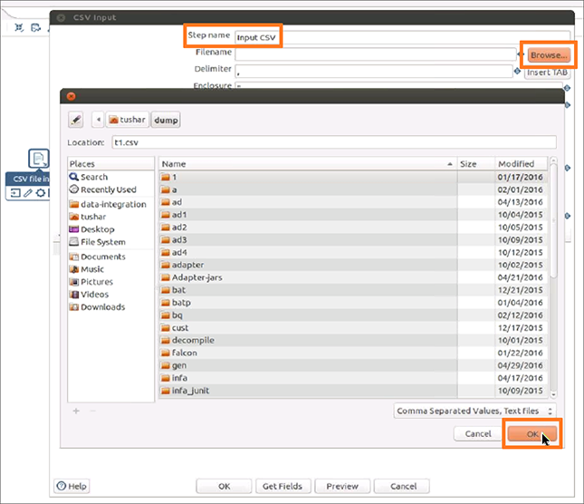

6.   In the CSV Input dialog box, click **Get Fields**.
7. Enter the number of lines you would like to sample in the Sample size dialog box. The default setting is 100. Click **OK** when you are ready.

     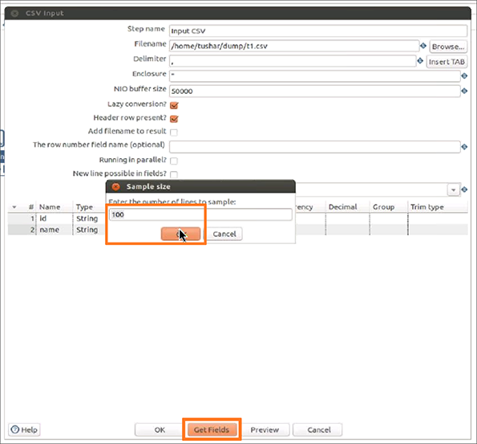

    It will read the file and suggest the field name and type.

     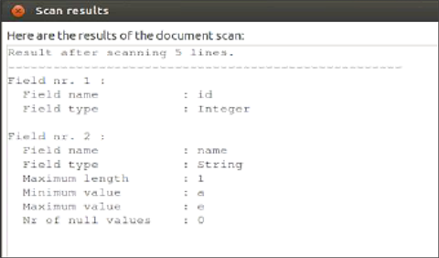

8. Click **Preview** to preview the data.
9. Enter the number of rows to preview in the Preview size dialog box. The default setting is 1000. Click **OK** to start the transformation in preview.

     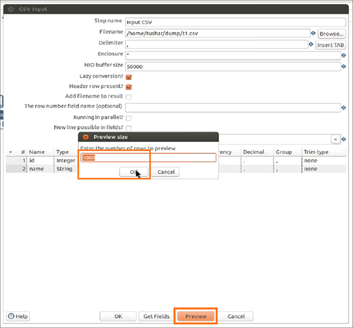

10.  Examine the preview data, then click **Close**. You may want to verify that you are able to read the data using the SQL query from Falcon.

     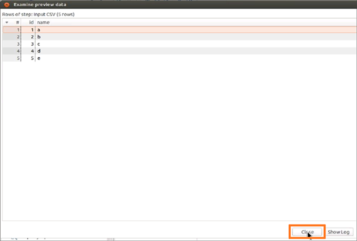

11.  Click **OK** in the CSV Input dialog to confirm your CSV input settings.
12.  Click **Output** under the Design tab to expand it, and drag and drop **Table output** to the Transformation window.

     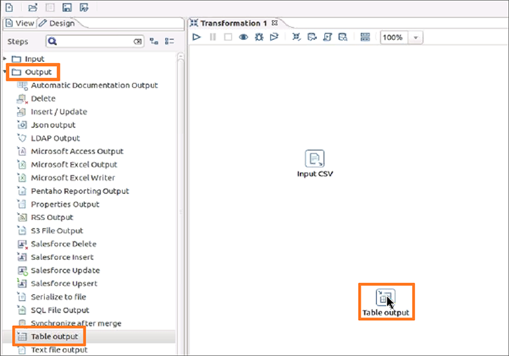

13.  Double click the **Table output** icon to open the Table output dialog box.
14.  Name the step. Then click **New** to create a new connection.

     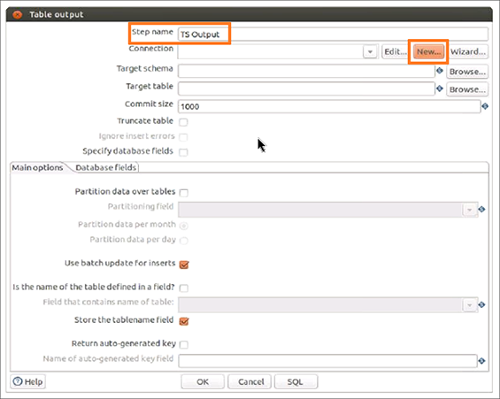

15.  Enter or select the following information in the Database Connection dialog box:

    -   Connection Name
    -   Connection Type: Generic database
    -   Access: Native (JDBC)
    -   Custom Connection URL: jdbc:simba://<server_ip\>:12345;Database=<database_name or schema_name\>

        <server_ip\> is the IP of your Falcon cluster. <database_name\> is the name of the database you want to connect to. Use TQL to create a database name if needed.

    -   Custom Driver Class Name: com.simba.client.core.jdbc4.JDBC4Driver

**Note:** Please ensure that there are no leading or trailing spaces in the Custom Connection URL and the Custom Driver Class Name fields. JDBC will get confused if there are any such spaces, and as a result, will not be able to establish a connection.

    -   User Name and Password

        The User Name and Password are your ThoughtSpot credentials, but you can elect to keep these fields empty.

     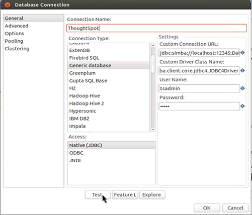

16.  Click **Test** to test your database connection. If you are able to make a successful connection to the Falcon Simba Server, click **OK**.

     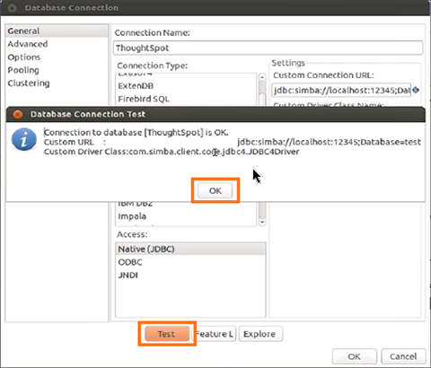

17.  Click **OK** in the Database Connection dialog box to create the new connection.
18.  In the Table output dialog box, select the connection you just created.
19.  Click **Browse** next to the Target schema field, the select your **Target schema**. Click **OK** when you are done.
20.  Connect the Input CSV icon to the Table output icon by clicking and dragging an arrow. When prompted, choose **Main output of step**.

     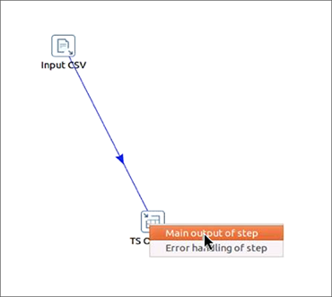

21.  Double click the **Table output** icon to reopen the Table output dialog box.
22.  Enter a **Target table name**. Then click **SQL**.

     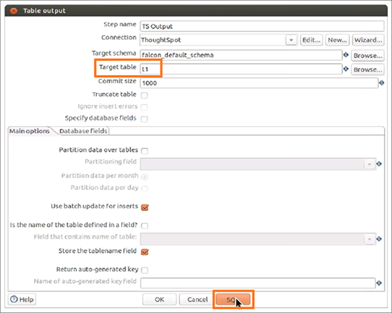

23.  In the Simple SQL editor dialog box, click **Execute** to see the results of the SQL statements.

     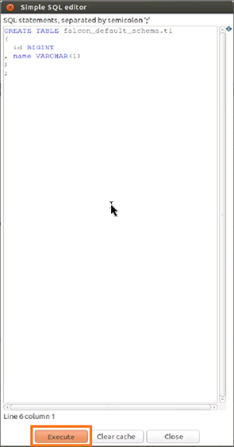

24.  Close all open dialog boxes.
25.  Click the **Play** button at the top of the Transformation window to execute the transformation.

     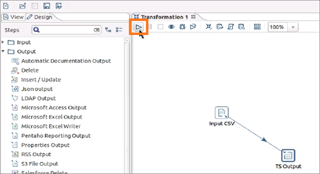

26.  Click **Launch** in the Execute a transformation dialog box.

     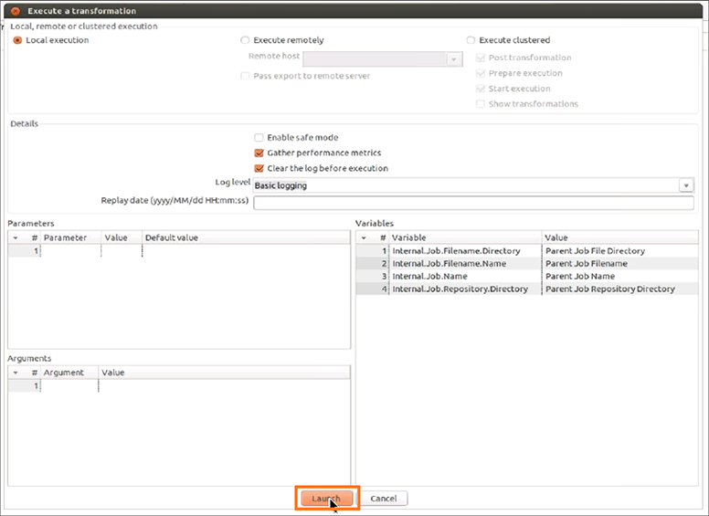

27.  You will be asked to save it if you have not already.
28.  View the Execution Results.

     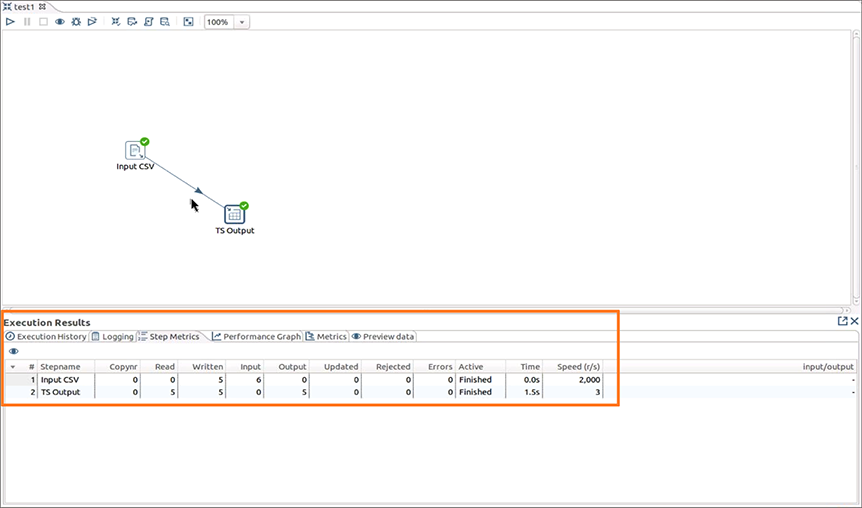


**Parent topic:** [About Pentaho](../../data_integration/pentaho/about_pentaho.html)
