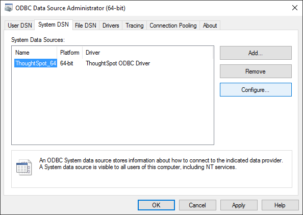
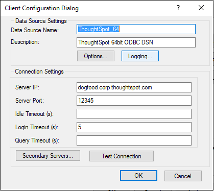
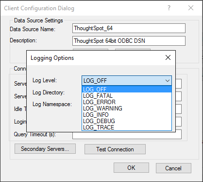
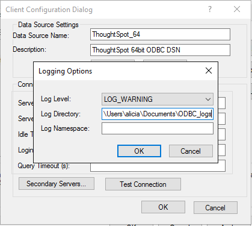

# Enabling ODBC Logs on Windows

If you need more information in order to troubleshoot ODBC connections, you can enable logging for ODBC. To do this on Windows, follow these instructions.

To enable ODBC logs on Windows:

1.   Open the ODBC Data Source Administrator and select the **System DSN** tab.
2.  Select your ThoughtSpot data source and click **Configure**.

     

3.  In the Client Configuration Dialog, click **Logging**.

     

4.  Choose a **Log Level**, depending on what level of verbosity you want to show in the logs.

     

5.  For **Log Directory:**, type in the fully qualified path where you want the logs to be saved.

     

6.   Click **OK** to save your settings, and **OK** again, to dismiss the ODBC Data Source Administrator.
7.   Run the ODBC load.
8.   Locate the log file that was generated, and send it to ThoughtSpot Support with a description of the problem.

**Parent topic:** [Troubleshooting Data Integrations](../../data_integration/troubleshooting/troubleshooting_intro.html)
