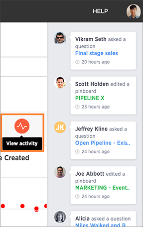

# Finding your way around

ThoughtSpot is organized into several sections to make navigation easy. You can reach them by using the menu bar.

  

These are the different sections in ThoughtSpot:

## Home

Click the logo to go to the home page. The home page contains:

-   Search bar - Click in the search bar to start a new search. This is the same thing as clicking **Search** in the top navigation bar.
-   Last viewed pinboard - The home page shows the last pinboard you looked at. The dropdown box on the top left of the pinboard lets you choose a different pinboard without having to leave the home page.
-   Activity - The activity button shows recent actions performed by other people.

    To view the activity panel, click on the **activity icon** on the right side of the home page.

      

    You can even click on one of the object names to jump to its location.

## Search

**Search** is where you will spend most of your time. It allows you to search and explore your data. Choose your data sources and type in the search bar at the top. As you type your search, results will appear in the main part of the screen as either a table or a chart.

To learn more about this section, visit [About search](../end_user_search/search.html#).

## Answers

Answers are the result of a single search. You can save an answer you want to work more on later, or just keep it for your personal use. Answers are for you alone, until you share them with others.

## Pinboards

Pinboards are collections of related search results. You can create your own pinboard or add to an existing one. Once a pinboard has been saved, it can be shared with others or viewed as a slideshow. The **Pinboards** page shows a list of saved pinboards. Click on one to view, edit, or share it.

To learn more about pinboards, visit [About pinboards](../pinboards/about_pinboards.html).

## Data

**Data** contains a list of data sources (tables and worksheets). These are usually loaded and managed by your administrator. However, you may be able to import a spreadsheet (Excel or CSV) here, if you have the correct privileges.

To learn more about this section, visit [Working with data](../data_view/data_intro_end_user.html#).

## Admin

**Admin** only appears if you have administrator privileges. This section is covered in the ThoughtSpot Administrator Guide.

## Help

**Help** is a support resource for ThoughtSpot. It contains short videos, a keyword reference, links to documentation, and other useful materials. You can also find the support contact information and software version number here.

## User

The **user icon** allows you to either view your preferences or log out. You can also change your icon here.

To learn more about this section, visit [About the user profile](about_user.html).

-   **[Log in to ThoughtSpot from a browser](../../../admin/setup/accessing.html)**  
To set up and explore your data, access ThoughtSpot from a standard Web browser using a username and password.
-   **[Log out of ThoughtSpot](../../../pages/end_user_guide/end_user_introduction/log_out_of_thoughtspot.html)**  
Once you're done with your search session, you can optionally log out of ThoughtSpot.
-   **[Set your ThoughtSpot locale](../../../admin/setup/set_your_thoughtspot_locale.html)**  
In addition to American English, ThoughtSpot also supports German and Japanese.

**Parent topic:** [Introduction](../../../pages/end_user_guide/end_user_introduction/introduction.html)

