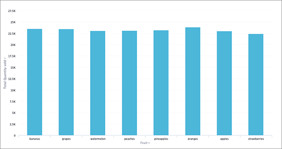

The column chart is one of ThoughtSpot's simplest, yet most versatile chart type. More often than not, the column chart will be chosen as your default chart type.

Column charts are vertical bar charts that display your data using rectangular bars. The length of the bar is proportional to the data value.

 

Your search needs at least one attribute and one measure to be represented as a column chart.

## Stacked column charts

The stacked column chart is similar to the column chart, but with one major difference. It includes a legend, which divides each column into additional sections by color.

Stacked column charts are typically used when you want to compare aggregated data and the data that it includes together. This chart type benefits when you add the **Show Data Labels** option. Turning it on will show the sum of the stacks at the top of each stack.

It is important to note that stacked column charts plot the y-axis as a percentage by default. You can choose to toggle **Show Y-Axis as %** on or off in the Configuration Options. This feature is also available for stacked area charts.

 

 

Your search needs at least two attributes and one measure to be represented as a stacked column chart.
