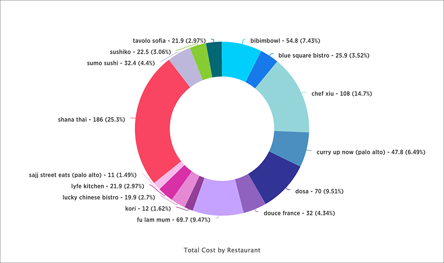
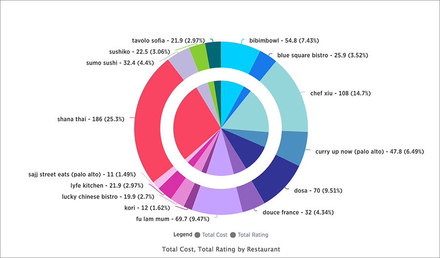

The pie chart is a classic chart type that displays your search in a circle. The pie chart ThoughtSpot shows is in the shape of a doughnut.

## Pie charts

Pie charts divide your data into sectors that each represent a proportion of a whole circle. You can display the exact values of each slice, in addition to the percentage values by toggling on **Show Data Labels** found under Change chart configuration.

 

Your search needs at least one attribute and one measure to be represented as a pie chart. Also, there must be fewer than 50 values in the attribute column.

-   **[Pie in pie charts](../../../pages/end_user_guide/end_user_search/about_pie_in_pie_charts.html)**  
The pie in pie chart can be created from a regular pie chart in order to compare more than one component of an attribute.

## Pie in pie charts

The pie in pie chart can be created from a regular pie chart in order to compare more than one component of an attribute.

Pie in pie charts show two concentric pie charts comparing different measures. To see a pie in pie chart, assign two different measures to the y-axis under **Configure Chart**.

 

Your search needs at least one attribute and two measures to be represented as a pie in pie chart. Also, there must be fewer than 50 values in the attribute column.
